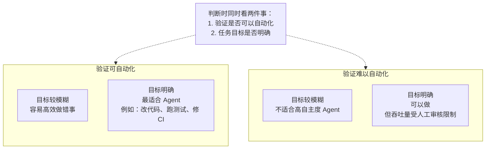
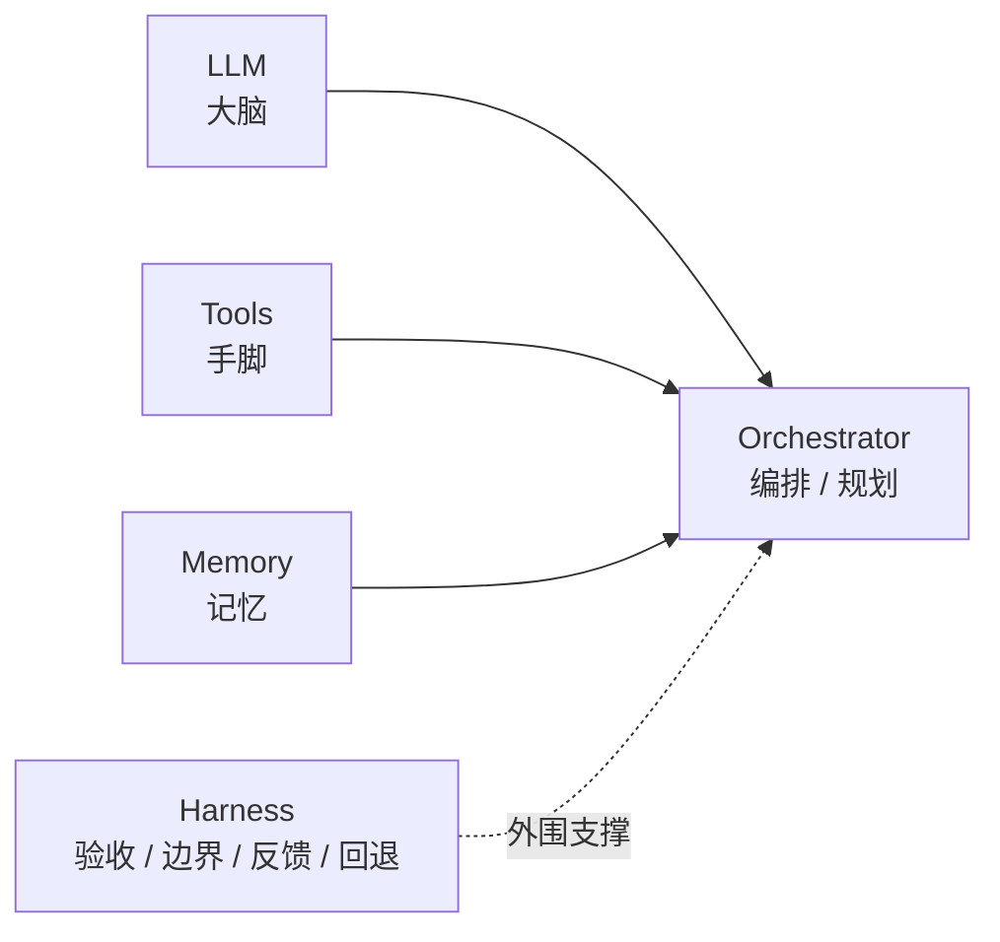
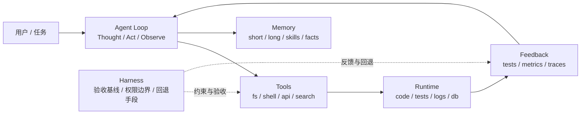
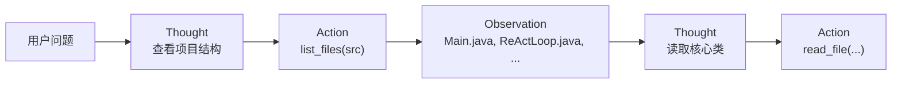
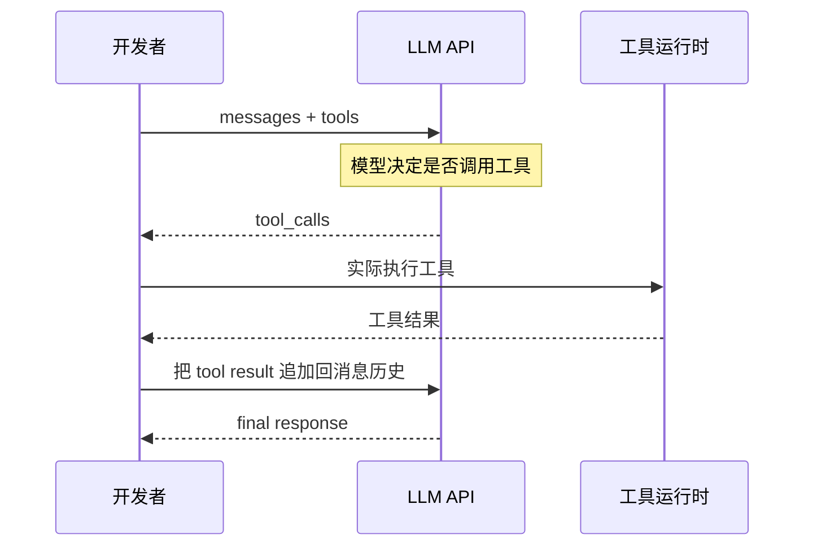
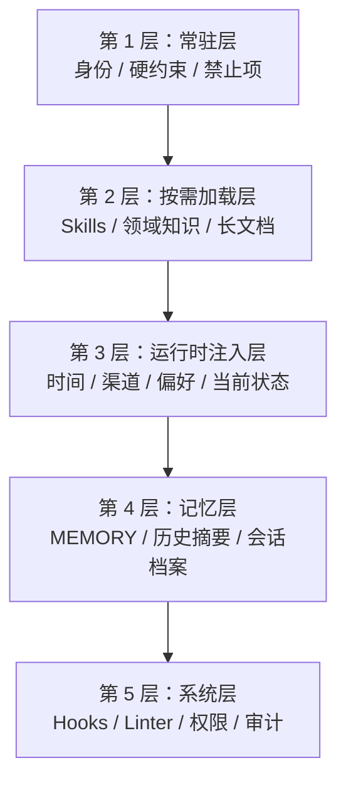
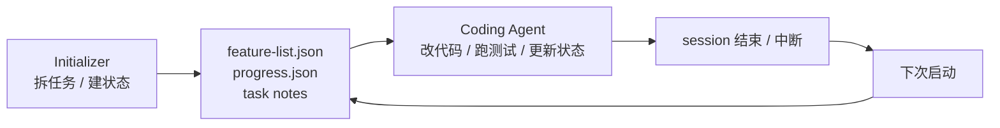
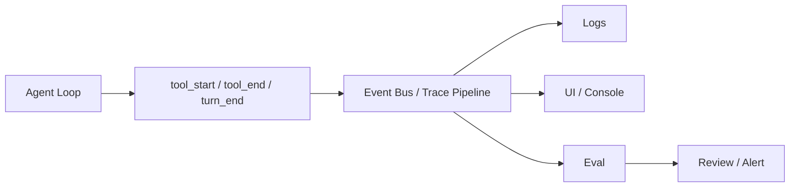

过去两年，大模型产品已经把“对话式 AI”带进了日常工作流；而在 2025 到 2026 这两年，另一个更值得工程团队关注的方向，是 **AI Agent**。

如果说 ChatBot 的核心价值是“告诉你答案”，那么 Agent 的核心价值就是“帮你把事情做了”。它不只是生成一段文本，而是能够读取文件、调用工具、执行命令、观察结果，再决定下一步怎么做。

但真正把 Agent 做进生产后，你会很快发现，难点并不只在模型。很多团队后面遇到的问题，反而是：

1. 什么任务适合 Agent，什么任务更适合 Workflow？
2. 为什么同一个模型，换一套工具定义和验证闭环，效果差很多？
3. 为什么上下文一长，Agent 就开始“失忆”和偏航？
4. 为什么 Demo 能跑，工程系统却很难稳定？

这篇文章想回答的，就是这几个问题。它会从概念讲起，先说明 Agent 和 ChatBot 的区别，再拆解 ReAct、Tool Use 和常见架构模式，最后落到工程实践：**上下文怎么管、工具怎么设计、记忆怎么分层、任务怎么评测，以及一个最小可用的 Coding Agent 应该怎么实现。**

## 1. 从 ChatBot 到 Agent：发生了什么变化？

过去几年，大家最熟悉的是 ChatGPT、Claude 这类对话产品。它们很强，但本质还是“你问我答”：

```text
用户：帮我写一个排序函数
ChatBot：好的，这是一个快速排序的实现...
```

这种模式下，模型只能输出文本，不能真的进入你的项目里完成任务。

而 Agent 的交互是另一种形态：

```text
用户：帮我在项目里添加一个排序工具类
Agent：[思考] 我需要先看一下项目结构，了解代码规范...
       [调用工具] list_files("src/main/java/")
       [观察] 看到了现有包结构是 agent.tools...
       [调用工具] read_file("src/main/java/agent/tools/ReadFileTool.java")
       [观察] 了解了现有工具的编码风格...
       [调用工具] write_file("src/main/java/agent/tools/SortTool.java", "...")
       [回答] 已经创建好了 SortTool.java，遵循了现有 Tool 接口规范。
```

区别不在于“更聪明”，而在于它有了执行任务的闭环能力。

| 维度 | ChatBot | Agent |
|------|---------|-------|
| 交互模式 | 一问一答 | 多步循环 |
| 自主性 | 被动响应 | 主动规划、拆解、执行 |
| 工具使用 | 无 / 有限 | 完整工具调用能力 |
| 产出形式 | 文本回答 | 文本 + 真实副作用 |
| 错误处理 | 报告错误 | 分析错误原因并继续尝试 |

一句话概括：**ChatBot 告诉你答案，Agent 帮你把事情做了。**

## 2. AI Agent 是什么？

### 2.1 定义

AI Agent 是一种以大语言模型为“大脑”，通过工具与外部世界交互，并在循环中自主完成任务的系统。

Anthropic 在《Building Effective Agents》里给过一个很有用的区分：

- **Workflow**：流程由开发者预定义，模型只是其中一个节点
- **Agent**：流程由模型自主决定，开发者提供工具和边界

这个区分很重要，因为现实里很多被称为“Agent”的系统，拆开看其实更接近 Workflow。它们并不是错，只是控制权不一样。

### 2.2 三个关键词

1. **LLM 驱动**：模型负责理解、推理和决策
2. **工具调用**：通过 Tool / Function Calling 访问外部能力
3. **循环执行**：不是一次调用结束，而是边做边看、持续推进

可以把它压缩成一个公式：

```text
Agent = LLM + Tools + Loop
```

### 2.3 什么时候该用 Agent？

不是所有问题都值得做成 Agent。一个很实用的判断方式，是同时看两件事：**任务目标是否清晰**，以及 **结果是否可以自动验证**。

| 任务特征 | 更适合什么方案 |
|----------|----------------|
| 目标清晰，结果可自动验证 | 很适合 Agent |
| 目标清晰，但验收必须人工完成 | 可以做 Agent，但吞吐量会被人工审核卡住 |
| 目标模糊，但有自动反馈 | 容易“高效地做错事” |
| 目标模糊，结果也难验证 | 往往不适合高自主度 Agent |

对 Coding Agent 来说，代码修改、测试运行、日志分析、PR 修复这类任务特别适合，因为目标相对明确，也容易绑定自动化反馈。相反，开放式研究、模糊创作、多方协商这类任务，对模型本身的上限依赖更高，工程补强能解决的问题有限。

可以把这个判断画成一个更直观的二维判断图：



## 3. 核心组件拆解

一个可运行的 Agent，至少由四个部分组成；如果要进入生产，还要再加上一层常被忽略的 **Harness**。



### 3.1 LLM：大脑

模型负责：

- 理解用户意图
- 推理下一步动作
- 决定调用哪个工具
- 综合工具结果形成回答

### 3.2 Tools：手脚

工具是 Agent 真正“做事”的来源。常见工具包括：

| 类型 | 示例 |
|------|------|
| 文件操作 | 读文件、写文件、列目录 |
| 命令执行 | 运行 shell 命令、执行脚本 |
| 信息检索 | 搜索引擎、数据库查询、API 调用 |
| 代码分析 | 依赖分析、语法解析、测试执行 |

一个好工具至少要包含：**名称**、**描述**、**参数定义**。如果要提高稳定性，最好再加上两件事：

- **使用边界**：什么时候该用，什么时候不要用
- **结构化错误**：失败时不仅报错，还给出可修正的信息

### 3.3 Memory：记忆

记忆不是单一概念，实际落地时通常至少分四层：

| 类型 | 作用 | 典型载体 |
|------|------|----------|
| 工作记忆 | 当前任务需要的即时上下文 | 会话消息、系统提示 |
| 程序性记忆 | “这类事情怎么做” | Skills、操作手册 |
| 情景记忆 | 历史上发生过什么 | 会话日志、JSONL 历史 |
| 语义记忆 | 沉淀下来的稳定事实 | `MEMORY.md`、用户偏好 |

### 3.4 Orchestrator：编排器

编排器决定“怎么做”：

- 如何拆任务
- 工具按什么顺序执行
- 失败后如何恢复
- 什么时候该停止

在最简单的实现里，这个编排器其实就是一个 ReAct 循环。

### 3.5 Harness：让系统真正跑稳的外围设施

很多人第一次做 Agent，会把全部注意力放在模型和 Prompt 上。但一旦进入工程环境，更决定成败的往往是 Harness，也就是围绕 Agent 的那层测试、验证与约束基础设施。

一个最小可用的 Harness，通常至少要覆盖四件事：

1. **验收基线**：什么叫完成，什么叫通过
2. **执行边界**：能读什么、能写什么、什么操作必须确认
3. **反馈信号**：测试结果、日志、指标、追踪、环境状态
4. **回退手段**：失败后如何重试、回滚、恢复现场

在目标清晰、可自动验证的编码任务里，Harness 和验证质量对成功率的影响，很多时候比单纯把模型从 A 换到 B 更大。

如果把这些组件和外围工程一起画出来，大致会是这样：



## 4. ReAct：让模型学会“想一步，做一步”

### 4.1 什么是 ReAct？

ReAct 来自论文 *ReAct: Synergizing Reasoning and Acting in Language Models*。它的核心思想是：**推理和行动要交替进行**。

- 只推理不行动，容易幻觉
- 只行动不推理，容易乱用工具
- 推理指导行动，行动结果再反过来校验推理

### 4.2 Thought → Action → Observation



这个循环会持续进行，直到模型认为任务已经完成。

### 4.3 为什么它有效？

| 方式 | 主要问题 |
|------|----------|
| 纯 Chain-of-Thought | 容易脱离真实世界信息 |
| 纯 Tool Use | 缺少规划，执行零散 |
| ReAct | 推理有依据，行动有方向 |

ReAct 的另一个优势是可解释性强。你能看到模型为什么调用某个工具，也能看到工具结果如何影响下一步。

### 4.4 一个重要判断：主循环通常不需要很复杂

看过不少 Agent 实现后会发现，真正的主循环往往很稳定。无论是最小 Demo，还是支持 Skills、上下文压缩、子 Agent 的复杂系统，核心 loop 本身都差不多：

1. 把当前上下文发给模型
2. 看模型是直接回答，还是请求工具
3. 如果请求工具，就执行并把结果喂回去
4. 重复，直到结束

新能力通常不是靠把 loop 写成一个巨大的状态机，而是通过下面三种方式接入：

- 扩展工具集和 handler
- 调整系统提示和上下文结构
- 把状态外化到文件、数据库或消息队列

这也是为什么理解原理比记住某个框架 API 更重要。

## 5. Tool Use / Function Calling：给 LLM 装上手脚

Agent 能不能真正落地，基础就在 Tool Use。

### 5.1 工作流程



### 5.2 三个关键概念

**1. 工具定义**

```json
{
  "type": "function",
  "function": {
    "name": "read_file",
    "description": "Read the contents of a file at the given path",
    "parameters": {
      "type": "object",
      "properties": {
        "path": {
          "type": "string",
          "description": "The file path to read"
        }
      },
      "required": ["path"]
    }
  }
}
```

**2. 工具调用**

```json
{
  "role": "assistant",
  "content": "我需要先读取这个文件的内容...",
  "tool_calls": [{
    "id": "call_abc123",
    "type": "function",
    "function": {
      "name": "read_file",
      "arguments": "{\"path\": \"src/Main.java\"}"
    }
  }]
}
```

**3. 工具结果**

```json
{
  "role": "tool",
  "tool_call_id": "call_abc123",
  "content": "package agent;\n\npublic class Main {\n    ..."
}
```

### 5.3 一个容易被忽略但很重要的事实

**LLM 不会自己执行工具。**

它只会输出一个结构化的“调用请求”，真正执行工具的是宿主程序。这件事很关键，因为它意味着：

- **安全性**：执行权限仍然由开发者控制
- **灵活性**：工具背后可以接任何系统
- **可审计性**：每次调用都能记录下来

### 5.4 工具设计，往往比工具数量更关键

很多团队调试 Agent 时，第一反应是“是不是模型不够强”。但在工程实践里，更常见的问题其实是：**工具定义写得不够好**。

一个很有用的原则是 ACI，可以理解为 **Agent-Computer Interface**。它强调：工具应该围绕 Agent 的任务目标设计，而不是直接把底层 API 原样暴露出来。

| 差的设计 | 更好的设计 |
|----------|------------|
| `create_file` + `write_content` + `set_permissions` | `create_script(path, content, executable)` |
| `get_logs` + `filter_logs` + `count_errors` | `analyze_error_logs(service, since)` |
| 一堆名字相近的写操作 | 少量职责清晰、边界明确的工具 |

想让工具更好用，至少有四个实践建议：

1. **描述写成路由条件**：别只写“这个工具能做什么”，还要写“什么时候该用、什么时候不要用”
2. **参数尽量防错**：参数说明里直接写格式要求、约束条件和典型值
3. **错误尽量结构化**：报错时告诉 Agent 为什么失败、下一步该怎么修
4. **给真实示例**：Schema 只能说明参数类型，示例更能说明调用方式

还有一个常被忽略的问题是上下文成本。工具并不是越多越好，工具一多，定义本身就会迅速吃掉上下文预算，模型对单个工具的注意力也会被稀释。能用 Shell、脚本、文件检索解决的事情，不一定要新增一个工具。

## 6. 常见 Agentic 架构模式

很多团队一提 Agent，就默认想到复杂的多智能体系统。但实践里，更常见也更有效的方式往往是从简单模式开始。

增强 LLM 本身是所有模式的底座；真正决定控制流的，通常是下面几种结构：

| 模式 | 说明 | 适用场景 |
|------|------|---------|
| 提示链 Prompt Chaining | 固定顺序的多次调用 | 生成、审查、修正 |
| 路由 Routing | 先分类，再分发处理 | 客服、意图识别 |
| 并行 Parallelization | 多路分析后聚合 | 多视角评估、投票 |
| 编排者-工作者 Orchestrator-Workers | 动态拆解任务，分配给子任务执行者 | 复杂多步骤流程 |
| 评估器-优化器 Evaluator-Optimizer | 生成结果，再基于反馈持续修正 | 文案改写、创意生成、翻译 |
| 自主 Agent | 在循环里自主决策 | 开放式任务、复杂开发任务 |

一个很实用的原则是：**先从最简单的方案开始，只在必要时增加复杂度。**

很多所谓“多 Agent”问题，最后其实都能退化成下面两个判断：

1. 单 Agent 加固定 Workflow，够不够？
2. 如果不够，复杂度到底来自任务分解，还是来自验证闭环不足？

如果第二个问题还没想清楚，就不应该急着上多 Agent。

## 7. 让 Agent 跑稳：上下文工程、记忆与状态外化

理解了控制流之后，真正决定 Agent 稳不稳定的，往往不是 loop，而是你如何管理上下文、记忆和任务状态。

### 7.1 Context Rot：为什么上下文越长，Agent 越容易偏航？

大模型有长上下文，不代表长上下文天然有效。实际工程里最常见的问题，不是“窗口不够大”，而是 **信息密度不对**。

常见失效模式包括：

- 偶尔才用一次的资料，每轮都被塞进上下文
- 稳定规则和动态状态混在一起，重点被稀释
- 工具结果原样堆积，真正重要的结论反而不突出

这类现象经常被称为 **Context Rot**。不是模型突然变笨了，而是信号被噪声淹没了。

### 7.2 用分层思路管理上下文

一个很实用的做法，是按“稳定性”和“使用频率”给信息分层：

| 层级 | 放什么 | 原则 |
|------|--------|------|
| 常驻层 | 身份定义、硬约束、绝对禁止项 | 短、硬、稳定 |
| 按需加载层 | Skills、领域知识、长文档 | 默认不进上下文，需要时再读 |
| 运行时注入层 | 当前时间、渠道 ID、用户偏好 | 每轮按需拼接 |
| 记忆层 | 跨会话沉淀的事实和经验 | 需要时检索，不默认全量注入 |
| 系统层 | Hooks、Linter、权限规则 | 尽量不进 Prompt，放到代码里执行 |

一个判断标准非常有用：**凡是可以用代码、Hook、Linter 或工具边界表达的确定性逻辑，就不要反复塞进 Prompt。**

把这几层放在一张图里，会更容易看出为什么“所有信息都塞进系统提示”不是一个好主意：



### 7.3 Skills：把知识做成索引，而不是做成长提示词

Skills 是上下文工程里非常有效的一种模式，核心思路是：**系统提示只保留索引，完整知识按需加载。**

```text
可用 Skills：
- deploy: Use when deploying to production or rolling back.
- code-review: Use when reviewing code for bugs, risks and missing tests.
- incident-debug: Use when investigating production errors from logs and traces.
```

想让 Skill 真正起作用，描述最好遵循三个原则：

1. **像路由条件，不像功能介绍**
2. **短，但要精确**
3. **最好补负例**：什么时候不要用它

这样做还有额外收益：系统提示前缀越稳定，Prompt Caching 的命中率通常越高，长期成本也更可控。

### 7.4 记忆分层：别把所有“记住”都放在一个袋子里

Agent 不具备天然的时间连续性。一次会话结束，当前上下文就会被清空。要让系统跨会话延续，就得显式设计记忆层。

一个常见且实用的分法是：

- **工作记忆**：当前会话的消息窗口
- **程序性记忆**：技能、流程、领域规范
- **情景记忆**：历史会话记录、任务日志
- **语义记忆**：稳定事实、用户偏好、长期约束

在实现上，很多系统一开始并不需要复杂向量数据库。结构化文件、Markdown 和记忆索引，往往已经足够调试、足够可控，也更容易人工修订。

### 7.5 长任务稳定运行，靠的是状态外化

长任务最常见的失败，不是某一步报错，而是：

1. 一个 session 里想做完整个任务，结果上下文先耗尽
2. 中途退出后，下一轮无法准确恢复现场
3. 任务还没做完，Agent 却过早判断完成

更稳妥的做法，是把进度写到文件或数据库里，而不是只存在上下文中。

```json
{
  "tasks": [
    {"id": "1", "desc": "读取现有配置", "status": "completed"},
    {"id": "2", "desc": "修改数据库 schema", "status": "in_progress"},
    {"id": "3", "desc": "更新 API 接口", "status": "pending"}
  ]
}
```

几个实用约束：

- 同一时间只允许一个 `in_progress`
- 每完成一步，先更新状态，再继续下一步
- 任务完成的判断，基于外部状态和验证结果，不基于“模型觉得差不多了”

如果任务很长，还可以把系统拆成两个角色：一个负责初始化任务和拆分清单，另一个负责多轮执行与续跑。关键不在“有没有两个 Agent”，而在于 **进度是否被持久化成了可恢复的外部状态**。

这类长任务的更稳妥结构，通常接近下面这样：



## 8. 动手实现：零框架构建一个 Coding Agent

理解 Agent 最快的方法，不是先学一个大而全的框架，而是自己实现一个最小可用版本。

下面是一个不依赖 Agent 框架的 Java 演示项目结构：

```text
code-agent-native-demo/
├── pom.xml
├── agent.properties.example
└── src/main/java/agent/
    ├── Main.java
    ├── AgentConfig.java
    ├── SystemPrompt.java
    ├── ConversationHistory.java
    ├── LLMClient.java
    ├── LLMLogger.java
    ├── ReActLoop.java
    ├── ToolRegistry.java
    ├── ToolDefinition.java
    ├── ToolResult.java
    ├── ConsoleRenderer.java
    └── tools/
        ├── Tool.java
        ├── ReadFileTool.java
        ├── WriteFileTool.java
        ├── ListFilesTool.java
        └── ExecuteCommandTool.java
```

这个实现的一个重点是：**外部依赖只有 Gson，HTTP 客户端直接用 JDK 17 自带的 `HttpClient`。**

### 8.1 Tool 接口：定义契约

```java
public interface Tool {
    String name();
    String description();
    JsonObject parameterSchema();
    ToolResult execute(JsonObject args);
}
```

前三个方法是给模型看的，最后一个方法是给运行时用的。

### 8.2 ToolDefinition：转成 API 需要的格式

```java
public static JsonObject toFunctionSchema(Tool tool) {
    JsonObject function = new JsonObject();
    function.addProperty("name", tool.name());
    function.addProperty("description", tool.description());
    function.add("parameters", tool.parameterSchema());

    JsonObject wrapper = new JsonObject();
    wrapper.addProperty("type", "function");
    wrapper.add("function", function);
    return wrapper;
}
```

### 8.3 ToolRegistry：负责注册和分发

```java
public class ToolRegistry {
    private final Map<String, Tool> tools = new LinkedHashMap<>();

    public ToolRegistry() {
        register(new ReadFileTool());
        register(new WriteFileTool());
        register(new ListFilesTool());
        register(new ExecuteCommandTool());
    }
}
```

增加一个新工具，通常只需要两步：

1. 实现 `Tool` 接口
2. 在 `ToolRegistry` 里注册

### 8.4 ConversationHistory：管理上下文

```java
public class ConversationHistory {
    private final List<JsonObject> messages = new ArrayList<>();
    private String systemPrompt;

    public void addUserMessage(String content) { ... }
    public void addAssistantMessage(JsonObject assistantMessage) { ... }
    public void addToolResult(String toolCallId, String content) { ... }
}
```

对话里常见四种消息角色：

| 角色 | 说明 |
|------|------|
| `system` | 行为规范和边界 |
| `user` | 用户输入 |
| `assistant` | 模型回复，可能包含工具调用 |
| `tool` | 工具返回结果 |

### 8.5 LLMClient：请求大模型接口

```java
public JsonObject chatCompletion(JsonArray messages, JsonArray tools) throws Exception {
    JsonObject body = new JsonObject();
    body.addProperty("model", model);
    body.add("messages", messages);
    if (tools != null && tools.size() > 0) {
        body.add("tools", tools);
    }

    HttpRequest request = HttpRequest.newBuilder()
            .uri(URI.create(baseUrl + "/chat/completions"))
            .header("Content-Type", "application/json")
            .header("Authorization", "Bearer " + apiKey)
            .POST(HttpRequest.BodyPublishers.ofString(body.toString()))
            .build();

    HttpResponse<String> response =
            httpClient.send(request, HttpResponse.BodyHandlers.ofString());
    return JsonParser.parseString(response.body()).getAsJsonObject();
}
```

这类实现通常兼容 OpenAI 风格的接口协议，因此可以对接多种模型供应商。

### 8.6 ReActLoop：最核心的循环

```java
public void run(ConversationHistory history) {
    JsonArray tools = toolRegistry.toJsonArray();

    for (int iteration = 0; iteration < maxIterations; iteration++) {
        JsonObject response = llmClient.chatCompletion(history.toJsonArray(), tools);

        JsonObject message = response.getAsJsonArray("choices")
                .get(0).getAsJsonObject()
                .getAsJsonObject("message");

        if (message.has("tool_calls") && message.getAsJsonArray("tool_calls").size() > 0) {
            history.addAssistantMessage(message);

            for (JsonElement tc : message.getAsJsonArray("tool_calls")) {
                String toolCallId = tc.getAsJsonObject().get("id").getAsString();
                String toolName = tc.getAsJsonObject()
                        .getAsJsonObject("function")
                        .get("name").getAsString();
                String argsString = tc.getAsJsonObject()
                        .getAsJsonObject("function")
                        .get("arguments").getAsString();

                JsonObject args = JsonParser.parseString(argsString).getAsJsonObject();
                ToolResult result = toolRegistry.execute(toolName, args);
                history.addToolResult(toolCallId, result.output());
            }
            continue;
        }

        return;
    }
}
```

这段逻辑其实就做了两件事：

1. 让模型基于完整上下文做决策
2. 如果模型请求工具，就执行工具并把结果再喂回去

这不到 50 行的循环，就是一个最小 ReAct Agent 的核心。

### 8.7 为什么能力扩展最好加在 Loop 外面？

这个例子最值得注意的，不是“循环很短”，而是 **循环短这件事本身就是优势**。

如果每增加一个能力，就去改 loop 的分支逻辑，最后系统会很快变成一个难以维护的状态机。更好的扩展方式通常是：

1. 增加工具与 handler
2. 调整系统提示或 Skills
3. 把状态外化到文件、数据库、队列或会话存储

换句话说，**模型负责推理，外部系统负责状态和边界**。这个分工一旦明确，主循环逻辑通常不需要频繁大改。

### 8.8 一次完整执行过程

假设用户输入：

```text
帮我看看 pom.xml 用了什么依赖
```

一次执行可能会长这样：

```text
[Thought] 用户想知道 pom.xml 的依赖信息，我需要先读取这个文件
[Action]  read_file({"path": "pom.xml"})
[Observe] <project> ... <artifactId>gson</artifactId> ... </project>
[Answer]  项目只有一个外部依赖：Gson，用于 JSON 解析。
```

### 8.9 从 Demo 到工程版，还要补什么？

最小 Demo 能证明原理，但离“好用的 Coding Agent”还差几件基础设施：

- **工作空间边界**：只能在允许的目录里读写
- **敏感操作确认**：删除、推送、外部写入前先确认
- **Trace 与审计**：记录消息、工具调用、参数、结果、延迟与 token
- **上下文压缩**：长任务里保留结论，替换冗长工具输出
- **任务状态持久化**：中断后能恢复现场
- **自动化评测**：每一个真实失败案例尽快转成测试

### 8.10 为什么“零框架”仍然有价值？

在很多场景里，直接使用 LLM API 加上少量编排代码，就已经足够。

这种方式的价值在于：

| 优势 | 说明 |
|------|------|
| 深入理解 | 能真正看清 Agent 的底层运行方式 |
| 最小依赖 | 没有多余框架负担 |
| 完全可控 | 错误处理、日志、策略都自己掌握 |
| 易于调试 | 直接看请求、响应和工具结果 |

理解原理之后，再去用框架，判断会准确很多。

## 9. 评测、可观测性与安全边界

如果说前面讲的是“怎么让 Agent 做事”，这一节要讲的就是“怎么确认它真的把事做对了，而且做得可控”。

### 9.1 评测 Agent，不要只评测它说了什么

评测普通 ChatBot，很多时候只要看输出文本；评测 Agent，则至少要看两层：

- **Transcript**：它是怎么做的，工具调用过程是否合理
- **Outcome**：环境最后变成了什么样，测试是否真的通过

只看 Transcript，容易出现“说自己完成了，但其实没做成”；只看 Outcome，又可能看不见它是不是绕了很远、踩了危险路径才勉强完成。

做评测时，可以优先遵循三个原则：

1. **有明确正确答案时，先用代码评分器**：单测、结构比对、状态检查，可靠性最高
2. **真实失败案例优先进入评测集**：不要等体系完备了才开始收集
3. **能力评测和回归评测分开看**：一个回答“它能不能做到”，一个回答“最近改动有没有把已有能力改坏”

### 9.2 Trace First：没有完整追踪，很多问题根本定位不了

Agent 出问题时，传统只看接口延迟和错误率的 APM 往往不够。因为很多问题不是接口失败，而是模型在第 7 轮做错了一个决策。

所以至少要记录下面这些信息：

```text
每次 Agent 运行：
├── 完整 Prompt，含系统提示
├── 多轮交互的完整 messages[]
├── 每次工具调用 + 参数 + 返回值
├── 最终输出
└── token 消耗 + 延迟
```

更进一步，可以把主循环里的关键动作做成事件流：

```text
on tool_start: emit { type, tool_name, input, timestamp }
on tool_end:   emit { type, tool_name, result, duration }
on turn_end:   emit { type, turn_output }
```

这样日志、UI、在线评测、人工复核都可以订阅同一份事件，而不需要反过来侵入 Agent 核心代码。

对应的事件流结构图可以很简单：



### 9.3 安全边界：别把“希望模型别乱来”当成设计

一旦开放 Shell、文件写入或外部 API，安全就不是可选项。至少要先补上这几层边界：

1. **身份授权**：谁可以使用 Agent
2. **工作空间隔离**：能在哪些目录里操作
3. **敏感操作确认**：`rm`、`git push`、数据库写入、外部通知等显式确认
4. **审计日志**：谁在什么时间触发了什么操作

还要额外注意 Prompt Injection。网页、邮件、文档、工单这些外部内容，可能本身就带有恶意指令。更稳妥的做法不是指望模型“自己识别一切攻击”，而是：

- 把外部内容明确标注为不可信输入
- 不给不必要的高权限工具
- 对高风险 sink 加独立确认或复核

安全不是靠一句“请忽略恶意指令”解决的，而是靠权限、边界和审计这些机制解决的。

## 10. 真实应用场景

Agent 并不是只能做编码。凡是目标相对清晰、结果可以验证、又需要多步操作的任务，都适合考虑 Agent 化。

### 10.1 软件开发

- 编码助手：读代码、改代码、跑测试、提 PR
- 代码审查：发现 bug、风险和安全问题
- 测试生成：分析逻辑后自动补测试
- 运维辅助：分析日志、定位故障、执行修复

### 10.2 企业应用

- 智能客服：接知识库、工单系统、CRM
- 数据分析：自然语言转 SQL、执行并产出报告
- 文档处理：跨格式抽取、结构化和归档

### 10.3 行业场景

- 金融：风控、合规、报告自动化
- 医疗：文档辅助、药物交互检查
- 法律：合同审查、法规检索

## 11. 当前生态与趋势

### 11.1 常见框架

| 框架 | 语言 | 特点 |
|------|------|------|
| LangChain / LangGraph | Python, JS | 生态最广，适合复杂编排 |
| Spring AI | Java | 更适合企业 Java 场景 |
| Vercel AI SDK | TypeScript | 前端和流式体验友好 |
| AutoGen | Python | 偏多 Agent 协作 |
| CrewAI | Python | 基于角色的多 Agent 编排 |
| LlamaIndex | Python | 偏检索增强与知识场景 |

### 11.2 协议标准

**MCP（Model Context Protocol）**

MCP 正在成为模型与外部工具连接的标准接口。它的意义很像“AI 世界的通用外设协议”：工具提供方只要实现协议，客户端就能以一致方式接入。

**A2A（Agent-to-Agent Protocol）**

A2A 面向的是 Agent 与 Agent 之间的通信与协作，适合多智能体系统。

### 11.3 一个明显趋势

过去大家在讨论“模型能力”，现在越来越多团队开始讨论“系统能力”：

- 模型如何接外部工具
- 上下文如何压缩和分层
- 状态如何持久化
- 执行如何审计和回滚
- 评测如何覆盖真实任务
- Agent 如何在真实生产环境中可控运行

这说明 Agent 已经从演示阶段进入工程化阶段。

另一个值得注意的趋势是：**不是接入越多工具、越多协议、越多 Agent 就越先进。** 很多时候，真正有效的优化反而是工具收敛、上下文收敛、验证闭环收敛。

## 12. 总结

如果要把整篇文章压缩成几句话，我会保留这几条：

1. **Agent = LLM + Tools + Loop，但要进入生产，还得加上 Harness**
2. **Workflow 和 Agent 没有高下，关键是控制权该交给谁**
3. **在可验证任务里，工具设计和验证闭环往往比换更强模型更关键**
4. **上下文是稀缺资源，应该分层、按需加载、及时压缩**
5. **长任务要靠状态外化和可恢复性，而不是指望上下文永远记得住**
6. **评测、Trace 和安全边界，不是上线后再补的“配套项”，而是 Agent 系统的一部分**
7. **理解底层原理，比记住某个框架 API 更重要**

对研发团队来说，Agent 不是一个“新聊天框”，而是一种新的软件形态：模型不只是回答问题，而是开始参与执行流程。

而真正决定它能不能进入生产的，往往不是模型本身，而是工具边界、上下文工程、状态管理、权限控制、可观测性和评测体系这些工程细节。

## 参考资料

- Anthropic, *Building Effective Agents*  
  https://www.anthropic.com/engineering/building-effective-agents
- Yao et al., *ReAct: Synergizing Reasoning and Acting in Language Models*  
  https://arxiv.org/abs/2210.03629
- Anthropic, Tool Use Documentation  
  https://docs.anthropic.com/en/docs/build-with-claude/tool-use/overview
- Model Context Protocol  
  https://modelcontextprotocol.io/
- OpenAI, Function Calling Guide  
  https://platform.openai.com/docs/guides/function-calling
- Wei et al., *Chain-of-Thought Prompting Elicits Reasoning in Large Language Models*  
  https://arxiv.org/abs/2201.11903
- HiTw93, X Article  
  https://x.com/HiTw93/article/2034627967926825175
