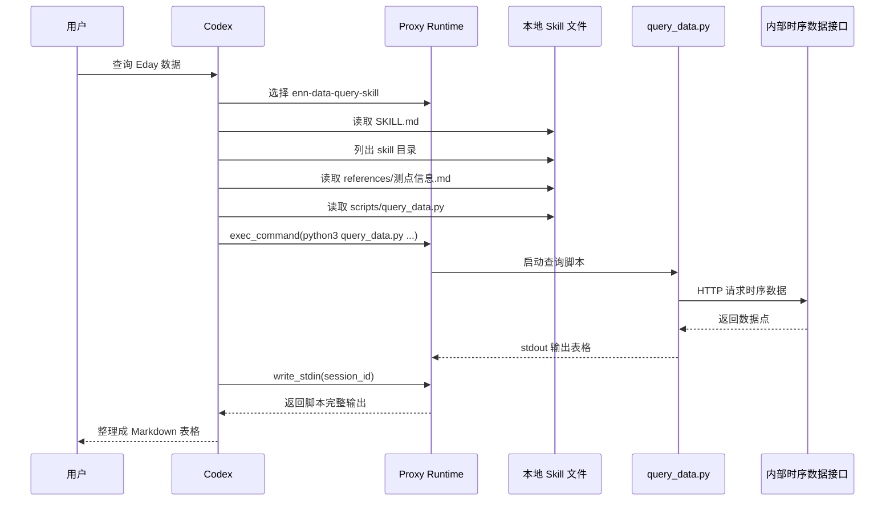

很多人聊到 Agent 的时候，都会把 **skill** 理解成“一段更高级的 prompt”。这个理解不能说完全错，但离真实工程实现还差得很远。

前几天我抓到了一份完整的 Codex proxy 日志。它不是演示版伪代码，而是一次真实请求从发起、选中 skill、读取文件、执行脚本，到最终组织回答的全链路记录。

这份日志最有价值的地方在于，它把一个问题直接讲清楚了：

> Codex 里的 skill，到底是模型自己“会了”，还是运行时帮它“装上去”的？

结论先说在前面：

**至少从这份日志看，Codex 的 skill 并不是模型内部原生长出来的一块神秘能力，而是一个运行时协议。它由五部分一起构成：提示词中的技能索引、本地 `SKILL.md` 文件、附属参考资料和脚本、函数工具，以及一个持续多轮推进的 agent loop。**

换句话说，skill 不是单点能力，而是：

```text
Skill = Prompt Index + Local Bundle + Tool Runtime + Execution Loop
```

这篇文章就基于这份真实日志，把 Codex 的 skill 机制完整拆开。

## 一、先看结论：Codex 的 skill 更像“运行时加载的能力包”

如果只看最终效果，你会觉得 Codex 很像“自己知道什么时候该用某个技能”。

但从日志看，真实过程其实是：

1. 运行时先把所有可用 skill 的名字、描述、路径和触发规则注入给模型。
2. 模型根据用户任务，自己判断是否命中某个 skill。
3. 一旦命中，模型再去读该 skill 的 `SKILL.md`。
4. 如果 `SKILL.md` 还引用了脚本、参考文档、模板文件，模型继续按需读取。
5. 最后通过函数工具去执行命令，观察结果，再组织最终回答。

这个过程说明，skill 的本质不是“把一大段 prompt 提前塞进 system prompt”，而是：

- 先暴露一个技能目录，让模型知道“有什么能力可用”。
- 再通过按需加载，控制上下文大小和执行成本。
- 真正干活时，依赖的是本地文件和工具，而不是纯文本想象。

这就是一个非常典型的 **progressive disclosure** 设计。

## 二、第一层：Codex 先把“技能索引”注入上下文，而不是直接注入全部技能正文

从请求体来看，Codex 的初始上下文并不只有普通的 system prompt。里面还额外塞了几层运行时输入：

- 通用角色与行为约束
- 权限和提权规则
- 协作模式
- `<skills_instructions>`
- 当前工作目录、时间、shell 等环境信息
- 用户本轮任务

如果把日志里的真实请求结构做一个简化，大致是这样的：

```json
{
  "model": "gpt-5.4",
  "instructions": "You are Codex, a coding agent based on GPT-5...",
  "input": [
    {
      "role": "developer",
      "content": "<permissions instructions>...</permissions instructions>"
    },
    {
      "role": "developer",
      "content": "<collaboration_mode>...</collaboration_mode>"
    },
    {
      "role": "developer",
      "content": "<skills_instructions>...</skills_instructions>"
    },
    {
      "role": "user",
      "content": "<environment_context>...</environment_context>"
    },
    {
      "role": "user",
      "content": "查询电站PARK15486_EMS01下设备IV_IV01的Eday测点数据..."
    }
  ],
  "tools": [
    { "type": "function", "name": "exec_command" },
    { "type": "function", "name": "write_stdin" }
  ],
  "tool_choice": "auto",
  "parallel_tool_calls": true
}
```

这里最关键的是 `<skills_instructions>`。它不是某个 skill 的全文，而是一个技能目录，内容大致包括：

- 当前可用 skill 列表
- 每个 skill 的 `name`、`description` 和 `file path`
- 什么时候应该触发 skill
- 选中 skill 后如何按需读取 `SKILL.md`
- 如果 skill 下面有 `scripts/`、`references/`、`assets/`，如何继续读取

也就是说，Codex 首先拿到的是一个 **技能索引**，而不是完整技能包。

这点非常重要。

因为如果把所有 skill 的完整正文都塞进 system prompt：

- context 会迅速膨胀
- 大量 skill 会和当前任务无关
- 长文说明会稀释用户问题本身
- 运行成本和噪音都会上去

所以更成熟的实现方式，是先把“有哪些 skill”告诉模型，然后让模型自己决定“这轮要不要用、该用哪一个”。

## 三、第二层：skill 的触发，本质上是模型对技能索引做路由判断

在这次任务里，用户的原始请求很简单：

```text
查询电站PARK15486_EMS01下设备IV_IV01的Eday测点数据，时间2024-11-11 10:00到11:00。
```

用户并没有手动说“请使用 `enn-data-query-skill`”。  
但是模型在第一轮 commentary 里，明确说出了：

```text
这次我直接用 `enn-data-query-skill` 来查企业测点时序数据，先读一下技能说明并确认可用的查询脚本与参数。
```

这说明 skill 的第一步不是脚本执行，而是 **路由**。

模型是怎么完成这个判断的？

原因就在技能索引里。日志中的 skill 列表里有一项：

```text
enn-data-query-skill: 查询企业测点时序数据、采集物联数据。
```

再配合 trigger rules，模型能把“企业测点时序数据”这个描述和用户问题匹配起来，于是决定启用这个 skill。

从工程角度说，这一步非常像分类器：

```text
用户任务 -> 与 skill description 做语义匹配 -> 命中某个 skill -> 进入该 skill 的工作流
```

因此，很多团队设计 skill 时最容易忽略的一件事，不是 `SKILL.md` 写得不够长，而是：

**skill 的 `description` 写得不够像路由条件。**

如果 description 太空泛，模型就很难稳定命中；如果 description 太窄，模型又会错过原本该触发的场景。

## 四、第三层：选中 skill 后，Codex 才开始读取 `SKILL.md`

选中 `enn-data-query-skill` 之后，模型并没有立刻执行查询命令。它先调用了两个工具：

```text
sed -n '1,220p' .agents/skills/enn-data-query-skill/SKILL.md
rg --files .agents/skills/enn-data-query-skill
```

这一步信息量很大。

它直接说明了三件事：

1. skill 的正文不在初始 prompt 里，而是一个磁盘上的文件。
2. 模型知道 skill 目录路径后，会主动去读 `SKILL.md`。
3. 它还会先列出 skill 目录内容，确认有哪些脚本和参考文档可用。

换句话说，Codex 的 skill 正文是 **文件化的**，而不是写死在请求体里。

这也是 skill 之所以能工程化的关键：

- prompt 负责发现 skill
- `SKILL.md` 负责定义 skill 的流程
- `scripts/` 负责真正可执行的逻辑
- `references/` 负责长文档和补充知识

这个结构和很多现代 agent 框架已经相当接近了。

## 五、第四层：`SKILL.md` 真正定义了 skill 的工作流

读取 `SKILL.md` 之后，Codex 拿到的不是“灵感”，而是一份明确的操作手册。

这份 skill 文档里写了几类信息：

### 1. 参数模型

它先定义了任务所需的 5 个参数：

- `systemCode`
- `deviceCode`
- `metric`
- `startTime`
- `endTime`

还给了这些参数在自然语言里的典型表述方式。

### 2. 参数提取规则

文档进一步告诉模型：

- 如何从自然语言识别编码类参数
- 如何识别测点名
- 如何把中文时间统一转换成 `yyyy-MM-dd HH:mm:ss`
- 如果结束时间没有日期，默认和开始时间同一天

### 3. 缺失参数的处理方式

如果参数不完整，不是瞎猜，而是必须向用户追问。

### 4. 执行命令模板

文档还明确告诉模型，拿到参数后应该执行：

```bash
python3 scripts/query_data.py \
  --systemCode "<systemCode>" \
  --deviceCode "<deviceCode>" \
  --metric "<metric>" \
  --startTime "<startTime>" \
  --endTime "<endTime>"
```

### 5. 补充信息来源

如果用户没给单位，就去 `测点信息.md` 里查。  
如果用户要求图表，就进一步用图表工具生成 SVG。

这就能看出一个成熟 skill 和“一段 prompt 模板”的区别了：

**真正的 skill 文档不是在和模型闲聊，而是在给模型定义任务协议。**

它描述的是：

- 输入是什么
- 缺失时怎么办
- 什么时候查参考资料
- 什么时候运行脚本
- 输出应该整理成什么样子

这已经很接近一个 DSL 了，只不过载体还是 Markdown。

## 六、第五层：Codex 会继续按需读取 skill 依赖，而不是只靠 `SKILL.md`

更有意思的是，Codex 读完 `SKILL.md` 还没有立刻执行查询。

它又做了两件事：

1. 去 `references/测点信息.md` 查 `Eday` 的单位
2. 去读 `scripts/query_data.py` 的源码

这一步特别能说明 skill 的工程化层次。

因为如果 skill 只是 prompt，模型读完说明文档就该开始“脑补”了。  
但这里不是。它继续去看：

- 参考文档里到底怎么定义 `Eday`
- 查询脚本的参数形式是什么
- 脚本内部具体怎么构造请求
- 查询结果最终会怎么打印

也就是说，Codex 的工作方式不是：

```text
看到 skill -> 凭印象执行
```

而是：

```text
看到 skill -> 读 workflow -> 读 references -> 读 scripts -> 再执行
```

这就是为什么 skill 体系比普通 prompt 更稳。  
因为它把“知识”和“动作”分别外置了：

- 长知识放在 `references/`
- 确定性逻辑放在 `scripts/`
- 模型负责规划、装配和决定调用时机

## 七、第六层：真正执行时，Codex 依赖的是函数工具，而不是模型直接访问外部世界

在这次日志里，Codex 不是通过 OpenAI 官方的 `shell` tool 直接执行命令，而是通过应用暴露给它的函数工具：

- `exec_command`
- `write_stdin`

也就是说，Codex 运行在一个自定义 agent runtime 上。

它的执行链路大致是：



这里最关键的一点是：

**模型不是直接连数据库、直接发 HTTP、直接访问内网接口，而是借助函数工具去调本地脚本，再由脚本和外部系统交互。**

这带来了两个很现实的好处：

1. 权限边界更清晰  
   模型能做什么，取决于 runtime 暴露给它哪些工具。

2. 结果更稳定  
   真正和外部系统交互的是代码，不是 prompt。

从系统设计角度看，这是非常合理的分层：

- 模型负责决策
- runtime 负责执行
- 脚本负责确定性业务逻辑

## 八、第七层：Codex 的 agent loop 不是“一次请求结束”，而是多轮推进

日志里还有一个特别容易被忽视的细节。

查询命令第一次执行后，并没有立刻得到完整结果，而是返回：

```text
Process running with session ID 59850
```

然后模型继续给用户发 commentary：

```text
查询命令已经发出，正在等接口返回结果。我先收一下输出，看这段时间内是否有数据点。
```

接着又调用了：

```json
{
  "name": "write_stdin",
  "arguments": {
    "session_id": 59850,
    "chars": "",
    "yield_time_ms": 1000
  }
}
```

这说明 Codex 的执行不是传统的一次 RPC，而是一个持续 loop：

1. 模型发起工具调用
2. runtime 执行工具
3. 工具可能返回中间态
4. 模型继续观察并决定下一步
5. 最终再组织成用户可读输出

这其实正是 Agent 和普通函数调用的核心差异之一。

普通函数调用是：

```text
输入 -> 执行 -> 输出
```

Agent loop 是：

```text
输入 -> 判断 -> 调用 -> 观察 -> 再判断 -> 再调用 -> 最终输出
```

而 skill 在这里扮演的角色，就是把“这类任务应该怎么循环推进”提前定义好。

## 九、第八层：这套实现并不是 OpenAI 官方托管 Skills API，而是应用层协议

如果你熟悉 OpenAI 最近公开的 `Responses + shell + skills` 方向，会发现这份日志有一个明显特点：

它没有出现官方托管技能的那类对象，比如：

- `tools[].environment.skills`
- `skill_reference`
- OpenAI 托管的 skill bundle

相反，这份日志里的 Codex 是这样做的：

1. 应用自己在 prompt 里塞入 `<skills_instructions>`
2. skill 文件存在本地目录 `.agents/skills/...`
3. 模型通过 `exec_command` 去读取这些文件
4. 模型再通过自定义函数工具执行脚本

所以更准确的说法是：

**从这份抓包观察到的 Codex，更像是“在 OpenAI 大模型之上实现的一层应用级 skill 协议”，而不是直接依赖官方托管 Skills API。**

这并不意味着它不先进。恰恰相反，这种设计非常实用：

- 本地文件天然适合版本管理
- `SKILL.md` 容易人类维护
- `scripts/` 可以复用已有工程资产
- `references/` 可以承载长知识而不挤爆上下文
- 自定义函数工具能接入权限、沙箱、审批和日志体系

从工程落地看，这是一条非常自然的路线。

## 十、第九层：状态管理也很有意思，Codex 这里更像“应用侧重放上下文”

另一个值得注意的点是，这份日志里没有看到 `previous_response_id`。

这意味着这套 proxy 至少在这个案例里，没有完全依赖 OpenAI 的 stateful continuation，而是更像在每一轮请求里：

- 重放完整的开发者上下文
- 重放已有的 `function_call_output`
- 让模型基于最新历史继续推理

但与此同时，请求里又带着同一个 `prompt_cache_key`。

这说明它可能采用了这样一种折中设计：

1. 语义上由应用掌控完整上下文
2. 性能上借助 prompt cache 降低重复大 prompt 的成本

这是一个很典型的工程权衡。

好处是：

- 应用更容易掌控完整对话状态
- 切换模型或 runtime 更灵活
- 调试时更容易完整回放

代价是：

- 请求体很大
- 日志量很大
- 一旦抓包或日志外泄，暴露面也很大

## 十一、第十层：这份日志也暴露了 skill 机制的一些风险

这次抓包不仅让我们看清了 skill 怎么工作，也顺便暴露了一个现实问题：

**skill 机制越强，日志里泄露的东西也可能越多。**

从这份日志可以直接看到：

- 完整的 system / developer 指令
- 所有工具定义和参数 schema
- 权限边界与提权规则
- 已批准的命令前缀
- 本地工作目录和 skill 路径

更敏感的是，模型还读取了 `query_data.py` 的源码。  
结果日志里顺带落下了：

- 内网 API 地址
- 硬编码的 `USER_KEY`

这说明一件很现实的事：

当 skill 开始读取本地脚本、配置和参考文档时，**日志系统本身也会变成敏感面**。

如果你的 agent 系统要进入生产，至少要认真处理这些问题：

1. 是否需要记录完整 prompt 和完整工具输出
2. 是否应该对文件读取结果做脱敏
3. 是否应该禁止把源码全文落盘到普通日志
4. 是否需要把密钥从脚本中移走，改成环境变量或 secret manager

很多团队第一次做 agent，会把注意力放在“模型会不会选错 skill”，但从安全角度看，更危险的往往是“skill 选对了之后，日志把什么都记下来了”。

## 十二、总结：Codex 的 skill，不是神秘能力，而是一种工程协议

回到文章开头那个问题：

> Codex 的 skill，到底是模型自己“会了”，还是运行时帮它“装上去”的？

基于这份完整日志，我的答案很明确：

**Codex 的 skill 更像一种运行时协议，而不是模型权重里的原生器官。**

它的工作方式可以概括成下面这条链路：

1. 运行时在 prompt 里注入技能索引和触发规则
2. 模型根据用户任务做 skill 路由
3. 命中 skill 后按需读取本地 `SKILL.md`
4. 再继续读取 `references/`、`scripts/` 等依赖
5. 通过函数工具执行命令和脚本
6. 在 observation loop 里持续观察输出
7. 最终把结果整理成用户可读的回答

所以，skill 的本质不是“一段更长的提示词”，而是：

- 一套可发现的能力目录
- 一套可读取的本地规范
- 一套可执行的工具和脚本
- 一套持续运转的 agent loop

如果你也在设计自己的 agent skill 体系，那么一个很实用的经验是：

**不要只设计 prompt。要同时设计 skill index、skill body、references、scripts、tool runtime 和日志边界。**

只有这几层一起成立，skill 才会从“提示技巧”变成“可维护的工程能力”。

## 结语

很多时候，我们讨论 Agent 都停留在概念层：模型会规划、会调用工具、会多步执行。

但真正让一个 agent 系统跑起来的，不是这些抽象概念本身，而是它们背后的工程实现。

这份 Codex 抓包的意义就在这里。  
它让我们第一次能比较具体地看到，一个主流 coding agent 到底是怎样把 skill 这件事做实的：

- 不是全靠模型记忆
- 不是全靠 prompt 魔法
- 也不是单纯函数调用

而是把 **prompt、文件、脚本、工具和循环** 这几件事，拼成了一套能真正落地的系统。

这可能才是今天 Agent 工程最值得关注的地方。
